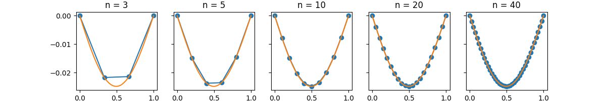
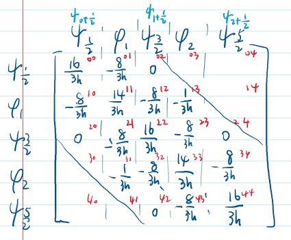
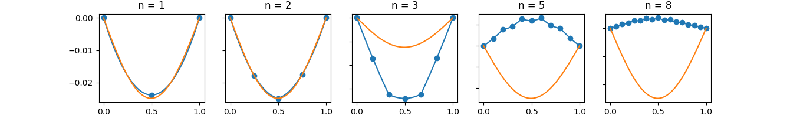

# 有限元分析 第一次程序作业

刘紫檀 SA21229063

## 问题描述

给定方程
$$
\left\{
\begin{aligned}
&-u'' = f \\
& u(0) = u(1) = 0
\end{aligned}
\right.
$$
分别下面两种有限维空间中进行方程的数值求解
$$
V_{h1} = \{v \in C^0([0, 1]) \quad v \vert _{I_j} = P^1(I_j), v(0) = v(1) = 0\} \\
V_{h2} = \{v \in C^0([0, 1]) \quad v \vert _{I_j} = P^2(I_j), v(0) = v(1) = 0\}
$$

## 问题求解

### 真实解

$$
-u'' = f \quad \Rightarrow \quad -u(x) = \int_{x_0}^\eta\int_{x_0}^\mu f(t) dt d\eta + Cx + D
$$

对 $ f(x) = (x-1) \sin x $ 我们有
$$
\begin{aligned}
-u(x) &= \int_1^\eta\int_1^\mu f(t) dt d\eta + Cx + D \\
     &= -x \sin x + \sin x - 2 \cos x + Cx + D
\end{aligned}
$$

带入定解条件，我们得到
$$
\left\{
\begin{aligned}
&u(0) = -2 + D = 0 \Rightarrow D = 2 \\
&u(1) = - 2 \cos 1 + C + D = 0 \Rightarrow C = -2 + 2 \cos 1\\
\end{aligned}
\right.
$$
所以解为
$$
u(x) = (x-1) \sin x + 2 \cos x + (2 - 2 \cos 1) x - 2
$$

下面比较图片中的真实解均为该解。

### 变分·约定

我们首先构造变分问题
$$
\begin{aligned}
\int_0^1 -u''(x) v(x) dx &=  -u'(x)v(x)  \bigg \vert^1_0  + \int_0^1 u'(x)v'(x)dx \\
&=  \int_0^1 u'(x)v'(x)dx \\
&= \int_0^1 f(x)v(x) dx \\
\end{aligned}
$$


我们约定对解空间离散后的节点分别为 $ 0 = x_0 < x_1 \dots < x_{n-1} < x_n = n $，共 $ n + 1 $ 个节点。记 $ h_i =  x_{i} - x_{i-1} $

对于有限维空间 $ V_{h} $，可以选择一组基函数 $ \{ \phi_i(x) \}_{i=1}^{n-1} $ 。此时，变分问题可以转换为有限维变分问题。设 $ u_H, \in V_{h1} $ ，我们有
$$
u_H = \sum_j u_j \phi_j \\
$$
同时，由于 $ v_H \in V_{h1}$  可以表示成 $ \{ \phi_i(x) \}_{i=0}^n $  的线性组合，所以不妨直接将 $ v_H $ 带入 $ \phi_0, \phi_1, ..., \phi_n $ ，即可得到下面的形式
$$
\begin{aligned}
\mathrm{LHS} 
&= \int_0^1 u_H'(x) \phi_i'(x) dx =
\int_0^1 (\sum_j u_j \phi_j'(x)) \phi_i'(x) dx \\
&= \sum_j u_j \int_0^1 \phi_j'(x) \phi_i'(x) dx \\

\\
\mathrm{RHS}
&= \int_0^1 f(x) \phi_i(x) dx
\end{aligned}
$$
记 $ K_{ij} = \int_0^1 \phi_j'(x) \phi_i'(x) dx $，$ U_j = u_j $ ，$ F_i =  \int_0^1 f(x) \phi_i(x) dx $，则可以写成矩阵形式
$$
KU = F
$$

### $ V_{h1} $ 空间下的矩阵形式

对于有限维空间 $ V_{h1} $，可以选择基函数 $ \{ \phi_i(x) \}_{i=0}^n $ 如下
$$
\phi_i(x) = \left\{
\begin{aligned}
&\frac{x-x_{i-1}}{x_{i}-x_{i-1}}, &x \in [x_{i-1}, x_{i}] \\
&\frac{x_{i+1} - x}{x_{i+1} - x_{i}}, &x \in [x_i, x_{i+1}] \\
&0, & x \notin [x_{i-1}, x_{i+1}]
\end{aligned}

\right.
$$
那么，我们可以计算 $\phi_i(x)$ 和 $ K_{ij} $ 如下
$$
\phi'_i(x) = \left\{
\begin{aligned}
&\frac{1}{x_i - x_{i-1}} = \frac{1}{h_i}  , & x \in (x_{i-1}, x_i)  \\
&\frac{1}{x_{i} - x_{i+1}} = -\frac{1}{h_{i+1}}, & x \in (x_i, x_{i+1}) \\
\end{aligned}
\right.

\\

K_{ij} = \int_0^1 \phi'_i(x) \phi'_j(x) dx = 
\left\{

\begin{aligned}
& 0 & | j - i | \ge 2 \\
& -\frac{1}{h_j} & j = i + 1 \\
&\frac{1}{h_{i+1}} + \frac{1}{h_{i}} & j = i \\


\end{aligned}

\right.
$$

> 其实 $ \phi_i'(x) $ 是选定的 Sobolev 空间下的弱导数 $ D_w^1 \phi $
>
> 这里计算别忘了乘上积分区间...当时犯了 $ \int_a^b C dx = C $ 的弱智错误
>
> 没写出来的情况对称性即可得到，就不倒腾这符号了...

$ F_i $ 的计算通过数值积分进行。

### $ V_{h2} $ 空间下的矩阵形式

对于分片二次多项式空间 $ V_{h2} $，我们需要在每个区间上构造二次多项式。

我们选择每个区间的端点和中心，构造 Lagrange 基函数如下
$$
\phi_j(x) = \left\{
\begin{aligned}
&\frac{(x - \frac{x_j + x_{j-1}}{2}) (x - x_{j-1})}{(x_j - \frac{x_j+x_{j-1}}{2})(x_j - x_{j-1})} = \frac{(2x - x_j - x_{j-1})(x-x_{j-1})}{h_j^2} & x \in (x_{j-1}, x_{j}) \\

&\frac{(x - \frac{x_j + x_{j+1}}{2}) (x - x_{j+1})}{(x_{j} - \frac{x_j + x_{j+1}}{2}) (x_j - x_{j+1})} = \frac{(2x - x_j - x_{j+1})(x-x_{j+1})}{h_{j+1}^2} & x \in [x_{j}, x_{j+1}) \\

& 0 & \text{otherwise}

\end{aligned}
\right.

\\

\psi_{i+\frac{1}{2}}(x) = \left\{
\begin{aligned}
&\frac{(x - x_i) (x - x_{i+1})}{(\frac{x_i + x_{i+1}}{2} - x_{i})(\frac{x_i + x_{i+1}}{2} - x_{i+1})} = -\frac{4(x-x_i)(x-x_{i+1})}{h_{i+1}^2} & x \in [x_i, x_{i+1}] \\

& 0 & \text{otherwise}

\end{aligned}
\right.
$$

> 目的：
>
> - 端点为 0，自己处为 1 - 这个区间 $ [x_j, x_{j+1}]$ 里面的插值由 $ \phi_j(x) $ 和 $ \phi_{j+1}(x) $ 共同完成
> - 在区间里是 Lagrange 插值的形式，保证次数

我们将基向量如此排列：$ \psi_{\frac{1}{2}}(x), \phi_1(x), \psi_{\frac{3}{2}}(x), \phi_2(x), \psi_\frac{5}{2}(x), \dots, \psi\frac{2n-1}{2}(x), \phi_{n-1}(x) $

那么，我们可以计算 $\phi_i(x)$ 和各个基向量之间的内积如下
$$
\phi'_j(x) = \left\{
\begin{aligned}
&\frac{1}{h_j^2} [4x - (3x_{j-1} + x_j)] & x \in (x_{j-1}, x_j) \\
&\frac{1}{h_{j+1}^2} [4x - (3x_{j+1} + x_j) ] & x \in (x_{j}, x_{j+1}) \\
&0 & \text{otherwise}
\end{aligned}
\right.

\\

\psi'_{i+\frac{1}{2}}(x) = \left\{
\begin{aligned}
&-\frac{4}{h_{i+1}^2} [2x - (x_i+x_{i+1})] & x \in (x_{i}, x_{i+1}) \\
&0 & \text{otherwise}
\end{aligned}
\right.

\\
$$
对于 $ \phi_j(x) $ 来说，其支集与 $ \phi_{j-1}, \phi_{j+1}, \psi_{j+\frac{1}{2}},  \psi_{j-\frac{1}{2}}$ 有交集，故计算如下
$$
\int_0^1 \phi'_i(x) \phi'_j(x) dx = 
\left\{
\begin{aligned}
& 0 & | j - i | \ge 2 \\
& -\frac{1}{3h_{i+1}} & j = i + 1 \\
&\frac{7}{3} (\frac{1}{h_{i+1}} + \frac{1}{h_{i}}) & j = i \\
\end{aligned}
\right.

\\

\int_0^1 \psi'_{i+\frac{1}{2}}(x) \psi'_{j+\frac{1}{2}}(x) dx = 
\left\{
\begin{aligned}
& 0 & j \ne i \\
& \frac{16}{3h_{i+1}} & j = i \\
\end{aligned}
\right.

\\

\int_0^1 \phi_i'(x) \psi'_{j+\frac{1}{2}}(x) dx = 
\left\{
\begin{aligned}
& 0 & |j - i| > 1 \\
& -\frac{8}{3h_{i+1}} & j = i \\
& -\frac{8}{3h_{i}} & j = i - 1
\end{aligned}
\right.
$$
对于 $ n $ 个区间（ $ 0 = x_0 < x_1 \dots < x_{n-1} < x_n = n $）格式，我们有 $ n + 1 $ 个节点，$ 2n-1 $ 个基矢量，其中 $ \psi $ 位于第 $ 1, 3, 5, \dots, 2n-1 $ 个，$ \phi $ 位于第 $ 2, 4, \dots, 2n - 2 $ 个。$ \psi $ 共 $ n $ 个，$ \phi $ 共 $ n - 1 $ 个。 观察到 $ \int_0^1 \phi_i'(x) \psi'_{j+\frac{1}{2}}(x) dx$ 对称，所以矩阵 $ K $ 是对称的。

### 代码实现

参考 `main.py` ，`PiecewiseLinearFEM` 为 $ V_{h1} $ 空间下的有限元求解，`PiecewiseQuaderaticFEM` 为 $ V_{h2} $ 空间下的有限元求解。

积分采用 Simpson 积分公式，解线性方程组采用 `np.linalg.solve`，其内部采用 LAPACK 的 `?gesv` 函数，通用实现为 LU 分解后直接法计算得到。

#### 运行说明

1. 确保 Python 不要太旧（我用的是 Python 3.8.3），如果没有 Python 的话，Windows 用户可以去 Microsoft Store 安装一个。

2. 安装 `pip` （必须）并安装 `virtualenv`（可选）。

3. 创建 `virtualenv` 并进入创建好的虚拟环境（可选）。

4. 安装 `scipy`, `numpy` 和 `matplotlib` 三个包

   ```bash
   # 如果没有安装 virtualenv 或没有启用，推荐装在用户目录下
   python -m pip install --user scipy numpy matplotlib
   # 如果安装并创建了虚拟环境，激活之，并在虚拟环境下安装即可
   pip install scipy numpy matplotlib
   ```

5. 运行 `main.py`: `python ./code/main.py`

#### $ V_{h1} $ 实现

为了方便实现，整理出刚度矩阵 $ K $ 的矩阵形式（虽然我其实是硬干上去的.jpg）：
$$
K = \frac{1}{h}
\begin{bmatrix}
2  & -1  \\
-1 & 2  & -1 \\
   & -1 & 2 & \ddots \\
   &  &\ddots & \ddots & -1 \\
   &  &  & -1 & 2
\end{bmatrix}
$$

> 上面展示的是均匀剖分的结果，其实 $ V_{h1} $ 我仔细讨论了一下下标，并且在 `solve` 方法里面写的也兼容非均匀剖分~~，但是实在懒得打矩阵了~~

下面分别展示在 $ n = 3, 5, 10, 20, 40 $ 下的情况。



图中橙色为真实解，蓝色线条为数值解，蓝色点为节点处的值。

解的误差如下：

| N    | $ L^1 $ error | order  | $ L^\infty $ error | order    |
| ---- | ------------- | ------ | ------------------ | -------- |
| 10   | 1.324e-04     | $ - $  | 2.985e-4           | $ - $    |
| 20   | 3.305e-05     | $2.00$ | 7.498e-05          | $ 1.99 $ |
| 40   | 8.261e-06     | $2.00$ | 1.875e-05          | $ 2.00 $ |
| 80   | 2.064e-06     | $2.00$ | 4.683e-06          | $ 2.00 $ |

> 注：计算阶用 $ \log_2(x_1 / x_2) $ 来近似估计。底为 2 是因为 10，20，40，80 的关系。
>
> 误差范数近似计算：
>
> - $ L^1 $ 误差采用对 $ u - u_I $ 均匀采样 1000 个点，并且用梯形公式近似计算 $ \int_0^1 |u - u_I| dx $ 实现
> - $ L^\infty $ 误差采用对 $ u - u_I $ 均匀采样 1000 个点，然后取采样点所对应函数值中的最大值实现

#### $ V_{h2} $ 实现

刚度矩阵整理如下（下面是 $ N = 3 $ 的手稿，不过已经足够反应特征了..）：



但是实现的时候出现了比较大的问题（见下图）



$ n \ge 3 $ 的时候就开始各种离谱，然后 $ n = 80 $ 左右的时候解就变成一条直线了，调了七八个小时都没发现原因~~，跪了~~。

## 一些有趣的问题

### 基向量过多

一开始的程序实现中，我选择了对于 $ 0 = x_0 < x_1 < \dots < x_n = 1 $ 有 $ \{\phi(i)\}_{i = 0}^n $ 共 $ n $ 个基向量，然后得到了一些离谱的结果。

> TODO: 调查一下，但是 $ V_{h2} $ 没调出来，所以这事也没管

