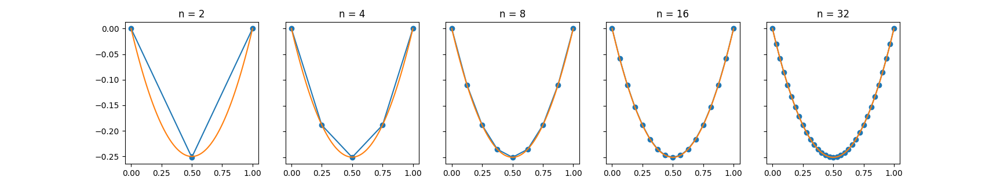
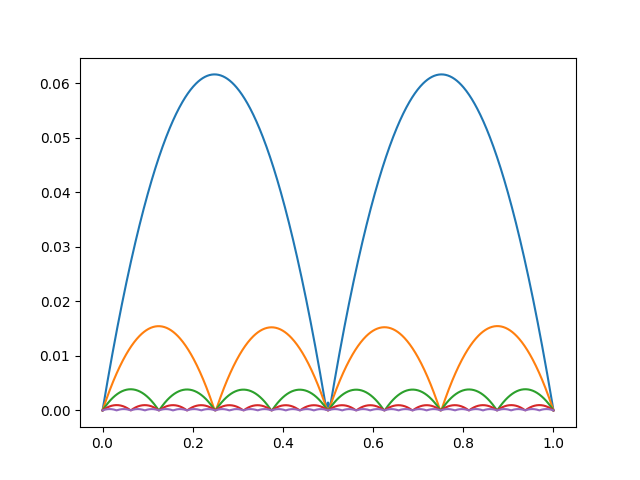
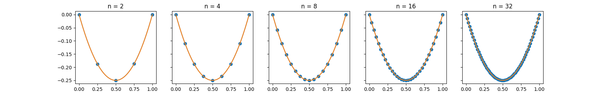
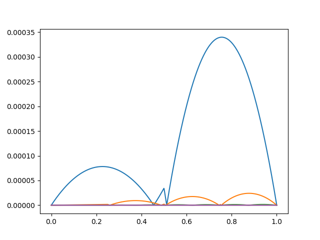
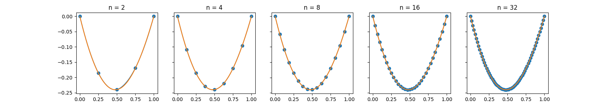
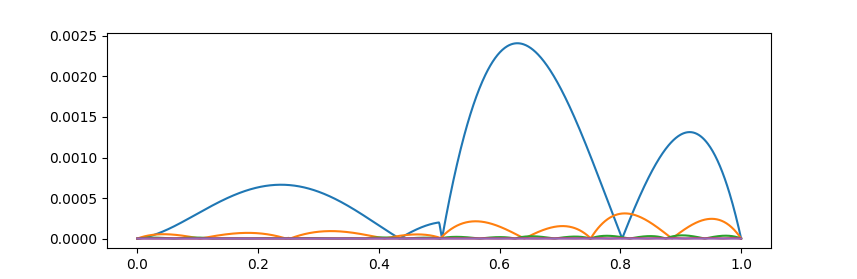

# 有限元分析 第二次程序作业

刘紫檀 SA21229063

## 问题描述

给定耗散-反应方程
$$
\left\{
\begin{aligned}
&-(d(x)u'(x))' + c(x)u(x) = f(x) & x \in [0, 1] \\
& u(0) = u(1) = 0
\end{aligned}
\right. \\
\text{where} \quad
\left\{
\begin{aligned}
& 0 < \beta < d(x) \\
& c(x) < \alpha < \infty
\end{aligned}
\right.
\quad
\text{for} \quad x \in (0, 1)
$$
分别下面两种有限维空间中进行方程的数值求解
$$
V_{h1} = \{v \in C^0([0, 1]) \quad v \vert _{I_j} = P^1(I_j), v(0) = v(1) = 0\} \\
V_{h2} = \{v \in C^0([0, 1]) \quad v \vert _{I_j} = P^2(I_j), v(0) = v(1) = 0\}
$$

测试时带入
$$
\left\{
\begin{aligned}
&d(x) = \sin x + 2 \\
&c(x) = x^2 + 1 \\
&u(x) = x(x-1) \\
&f(x) = x (x - 1) (x^2 + 1) - 2 (\sin x + 2) - (2 x - 1) \cos x
\end{aligned}
\right.
$$
验证即可。对于 $ P^2 $ 空间来说，选择如下效果更好（上面的 $u(x) $ 本身就是二次的）
$$
\left\{
\begin{aligned}
&d(x) = \sin x + 2 \\
&c(x) = x^2 + 1 \\
&u(x) = (x-1)\sin x \\
&f(x) = (x-1) \sin (x) \left(x^2+\sin (x)+3\right)-(x-1) \cos ^2(x)-(3 \sin (x)+4) \cos (x)
\end{aligned}
\right.
$$

> 详情见下面分析。

## 问题求解

### 变分·约定

首先选取原问题的合适的解函数空间。

因为涉及解函数的二阶导数，所以选择试函数 $v$（和解函数 $u $ 的）空间 $ V= W_2^1([0, 1]) $，否则不一定可以做分部积分。

> 其实没那多事，毕竟 $ P^1 $ 和 $ P^2 $ 都好的很。
>
> 我们只需要对于变分后的问题的积分在 $ V $ 里面可以做就行（i.e. 变分后问题中出现的弱导数存在），所以选 $ W_2^1 $

$$
\begin{aligned}
 &-(d(x)u'(x))' + c(x)u(x) = f(x) \\
\Rightarrow & \int_0^1 -(d(x)u'(x))'v(x) dx + \int_0^1 c(x)u(x) v(x) dx = \int_0^1 f(x) v(x) dx \\
\Rightarrow & -d(x)u'(x)v(x) \bigg | _0^1  + \int_0^1 d(x) u'(x) v'(x) dx + \int_0^1 c(x)u(x) v(x) dx  = \int_0^1 f(x) v(x) dx \\
\Rightarrow & \int_0^1 d(x) u'(x) v'(x) dx + \int_0^1 c(x)u(x) v(x) dx  = \int_0^1 f(x) v(x) dx

\end{aligned}
$$

然后我们有
$$
a(u, v) = \int_0^1 d(x) u'(x) v'(x) dx + \int_0^1 c(x) u(x) v(x) dx \\
F(v) = \int_0^1 f(x) v(x) dx
$$
观察到
$$
\left\{
\begin{aligned}
a(u, v) &= a(v, u) \\
a(u, v) &= \int_0^1 d(x) u'(x) v'(x) dx + \int_0^1 c(x) u(x) v(x) dx \\
&= \int_0^1 -(d(x)u'(x))'v(x) dx + \int_0^1 c(x) u(x) v(x) dx \\
&= \int_0^1 |(d(x)u'(x))'v(x)| dx + \int_0^1 |c(x) u(x) v(x)| dx \\
&\le ||(du')'||_{L^2} ||v||_{L^2} + ||c||_{L^2} ||u||_{L^2} ||v||_{L^2} \\
&\le ||(du')'||_{L^2} ||v||_{L^2} + (\alpha \cdot 1) ||u||_{L^2} ||v||_{L^2} \\
a(v, v) &\quad 还得考虑一下

\end{aligned}
\right.
$$

> 好像没有 $ d(x) $ 的上界有点放缩不出来，但是这例子里面的 $ d(x) $ 在 [0, 1] 上是有界的，所以这几个例子都没问题，就没管了

如果上面的对称、有界、强制性（coercive）都成立，那么用 Riesz 表示定理就可以得到 $ u_h $ 存在唯一。这构成了变分问题可以做的理论基础。

我们约定对解空间离散后的节点分别为 $ 0 = x_0 < x_1 \dots < x_{n-1} < x_n = n $，共 $ n + 1 $ 个节点。记 $ h_i =  x_{i} - x_{i-1} $。

### Gauss 积分公式

对于 $ [-1, 1] $ 上权函数 $ W=1 $ 的公式（Gauss-Legendre 求积公式），我们取 $ n = 2 $ 就有 $ 2n-1 = 3 $ 阶代数精度，已经够 $ P^2 $ 空间积分了。

此时$ n = 2$，高斯点$ x_k $ 为 $ \pm 1/\sqrt 3$，$ A_k $ 为 1，带入下式即可
$$
\int_a^b f(x) dx = \frac{b-a}{2} \sum_{i=1}^n A_i f(\frac{a+b}{2} + \frac{b-a}{2} x_i)
$$

### $ V_{h1} $ 空间下的矩阵形式

对于有限维空间 $ V_{h1} $，可以选择基函数 $ \{ \phi_i(x) \}_{i=1}^n $ 如下
$$
\phi_i(x) = \left\{
\begin{aligned}
&\frac{x-x_{i-1}}{x_{i}-x_{i-1}}, &x \in [x_{i-1}, x_{i}] \\
&\frac{x_{i+1} - x}{x_{i+1} - x_{i}}, &x \in [x_i, x_{i+1}] \\
&0, & x \notin [x_{i-1}, x_{i+1}]
\end{aligned}

\right.
$$
那么，我们可以计算 $\phi'_i(x)$ 和 $ K_{ij} $ 如下
$$
\phi'_i(x) = \left\{
\begin{aligned}
&\frac{1}{x_i - x_{i-1}} = \frac{1}{h_i}  , & x \in (x_{i-1}, x_i)  \\
&\frac{1}{x_{i} - x_{i+1}} = -\frac{1}{h_{i+1}}, & x \in (x_i, x_{i+1}) \\
\end{aligned}
\right.

\\

K_{ij} = \int_0^1 d(x) \phi'_i(x) \phi'_j(x) dx + \int_0^1 c(x) \phi_i(x) \phi_j(x) dx
$$

然后用这两个积分用两点的 Gauss 积分公式积分在有值的每个小区间进行积分就可以了。

### $ V_{h2} $ 空间下的矩阵形式

对于分片二次多项式空间 $ V_{h2} $，我们需要在每个区间上构造二次多项式。

我们选择每个区间的端点和中心，构造 Lagrange 基函数如下
$$
\phi_j(x) = \left\{
\begin{aligned}
&\frac{(x - \frac{x_j + x_{j-1}}{2}) (x - x_{j-1})}{(x_j - \frac{x_j+x_{j-1}}{2})(x_j - x_{j-1})} = \frac{(2x - x_j - x_{j-1})(x-x_{j-1})}{h_j^2} & x \in (x_{j-1}, x_{j}) \\

&\frac{(x - \frac{x_j + x_{j+1}}{2}) (x - x_{j+1})}{(x_{j} - \frac{x_j + x_{j+1}}{2}) (x_j - x_{j+1})} = \frac{(2x - x_j - x_{j+1})(x-x_{j+1})}{h_{j+1}^2} & x \in [x_{j}, x_{j+1}) \\

& 0 & \text{otherwise}

\end{aligned}
\right.

\\

\psi_{i+\frac{1}{2}}(x) = \left\{
\begin{aligned}
&\frac{(x - x_i) (x - x_{i+1})}{(\frac{x_i + x_{i+1}}{2} - x_{i})(\frac{x_i + x_{i+1}}{2} - x_{i+1})} = -\frac{4(x-x_i)(x-x_{i+1})}{h_{i+1}^2} & x \in [x_i, x_{i+1}] \\

& 0 & \text{otherwise}

\end{aligned}
\right.
$$

我们将基向量如此排列：$ \psi_{\frac{1}{2}}(x), \phi_1(x), \psi_{\frac{3}{2}}(x), \phi_2(x), \psi_\frac{5}{2}(x), \dots, \psi\frac{2n-1}{2}(x), \phi_{n-1}(x) $。

我们计算导数如下
$$
\phi'_j(x) = \left\{
\begin{aligned}
&\frac{1}{h_j^2} [4x - (3x_{j-1} + x_j)] & x \in (x_{j-1}, x_j) \\
&\frac{1}{h_{j+1}^2} [4x - (3x_{j+1} + x_j) ] & x \in (x_{j}, x_{j+1}) \\
&0 & \text{otherwise}
\end{aligned}
\right.

\\

\psi'_{i+\frac{1}{2}}(x) = \left\{
\begin{aligned}
&-\frac{4}{h_{i+1}^2} [2x - (x_i+x_{i+1})] & x \in (x_{i}, x_{i+1}) \\
&0 & \text{otherwise}
\end{aligned}
\right.

\\
$$
对于 $ n $ 个区间（ $ 0 = x_0 < x_1 \dots < x_{n-1} < x_n = n $）格式，我们有 $ n + 1 $ 个节点，$ 2n-1 $ 个基矢量，其中 $ \psi $ 位于第 $ 1, 3, 5, \dots, 2n-1 $ 个，$ \phi $ 位于第 $ 2, 4, \dots, 2n - 2 $ 个。$ \psi $ 共 $ n $ 个，$ \phi $ 共 $ n - 1 $ 个。 

然后我们可以组装内积矩阵如下
$$
K_{ij} =
\left\{
\begin{aligned}
&\int_0^1 d(x) \phi'_{i/2}(x) \phi'_{j/2}(x) dx + \int_0^1 c(x) \phi_{i/2}(x) \phi_{j/2}(x) dx 
& 2\ |\ i, 2\ | \ j \\

&\int_0^1 d(x) \psi'_{\left \lfloor{i/2}\right \rfloor   + 1/2}(x) \phi'_{j/2}(x) dx + \int_0^1 c(x) \psi_{\left \lfloor{i/2}\right \rfloor  + 1/2} (x) \phi_{j/2}(x) dx 
& 2\not|\ i, 2\ | \ j
\\

&\int_0^1 d(x) \phi'_{i/2}(x) \psi'_{\left \lfloor{j/2}\right \rfloor + 1/2}(x)  dx + \int_0^1 c(x) \phi_{i/2}(x)  \psi_{\left \lfloor{j/2}\right \rfloor  + 1/2} (x) dx 
& 2\ |\ i, 2\not| \ j
\\

&\int_0^1 d(x) \psi'_{\left \lfloor{i/2}\right \rfloor   + 1/2}(x) \psi'_{\left \lfloor{j/2}\right \rfloor + 1/2}(x) dx + \int_0^1 c(x) \psi_{\left \lfloor{i/2}\right \rfloor   + 1/2}(x) \psi_{\left \lfloor{j/2}\right \rfloor + 1/2}(x) dx 
& 2\not |\ i, 2\not| \ j
\\

\end{aligned}
\right.
$$

> 真刺激...有 8 个积分要写

### 代码实现

参考 `main.py` ，`PiecewiseLinearFEM` 为 $ V_{h1} $ 空间下的有限元求解，`PiecewiseQuadraticFEM` 为 $ V_{h2} $ 空间下的有限元求解。

积分采用 Simpson 积分公式，解线性方程组采用 `np.linalg.solve`，其内部采用 LAPACK 的 `?gesv` 函数，通用实现为 LU 分解后直接法计算得到。

#### 运行说明

1. 确保 Python 不要太旧（我用的是 Python 3.8.3），如果没有 Python 的话，Windows 用户可以去 Microsoft Store 安装一个。

2. 安装 `pip` （必须）并安装 `virtualenv`（可选）。

3. 创建 `virtualenv` 并进入创建好的虚拟环境（可选）。

4. 安装 `scipy`, `numpy` 和 `matplotlib` 三个包

   ```bash
   # 如果没有安装 virtualenv 或没有启用，推荐装在用户目录下
   python -m pip install --user scipy numpy matplotlib
   # 如果安装并创建了虚拟环境，激活之，并在虚拟环境下安装即可
   pip install scipy numpy matplotlib
   ```

5. 运行 `main.py`: `python ./code/main.py`

#### $ V_{h1} $ 实现



$ |u-u_h|$ 的图像如下（都画在一起了..）

> 误差都是分段二次的，这说明算出来的还挺对，因为真实解 $ u(x) $ 就是个二次函数。



误差和误差阶估计如下

| n | $ L_1 $ 误差 | $ L_\infty $ 误差 | $ L_1 $ 误差阶估计 | $ L_\infty $ 误差阶估计 |
| ---- | ---- | ---- | ---- | ---- |
|2|4.084e-02|6.166e-02| N/A                | N/A                     |
|4|1.016e-02|1.547e-02|1.99474e+00|2.00774e+00|
|8|2.535e-03|3.884e-03|1.99415e+00|2.00196e+00|
|16|6.336e-04|9.735e-04|1.99620e+00|2.00055e+00|
|32|1.584e-04|2.436e-04|1.99878e+00|2.00011e+00|
|64|3.960e-05|6.095e-05|1.99884e+00|2.00003e+00|
|128|9.899e-06|1.524e-05|1.99940e+00|1.99998e+00|

> - 误差采用在 [0, 1] 对 $ u - u_h $ 均匀采样 1000 点估算而得。
> - 误差阶假设 $ err(n) = Cn^{-\alpha} \Rightarrow \alpha = \log_{n_2/n_1}(err(n_1) / err(n_2) )$ 而得 


#### $ V_{h2} $ 实现

首先试验了
$$
\left\{
\begin{aligned}
&d(x) = \sin x + 2 \\
&c(x) = x^2 + 1 \\
&u(x) = x(x-1) \\
&f(x) = x (x - 1) (x^2 + 1) - 2 (\sin x + 2) - (2 x - 1) \cos x
\end{aligned}
\right.
$$
结果如图



$ |u-u_h|$ 的图像如下（都画在一起了..）

> 是分段二次的，只是加了绝对值，所以有些地方”卷“回来了。



误差和误差阶估计如下

| n | $ L_1 $ 误差 | $ L_\infty $ 误差 | $ L_1 $ 误差阶估计 | $ L_\infty $ 误差阶估计 |
| ---- | ---- | ---- | ---- | ---- |
|2|1.352e-04|3.398e-04|N/A|N/A|
|4|8.386e-06|2.406e-05|3.81971e+00|4.01078e+00|
|8|5.361e-07|1.587e-06|3.92218e+00|3.96727e+00|
|16|3.348e-08|1.017e-07|3.96367e+00|4.00143e+00|
|32|2.094e-09|6.431e-09|3.98351e+00|3.99851e+00|
|64|1.309e-10|4.044e-10|3.99125e+00|3.99997e+00|
|128|8.204e-12|2.535e-11|3.99563e+00|3.99604e+00|

> 助教：$ P^k $ 多项式空间的误差阶应该是 $ k + 1 $，不过这里为啥是 4 而不是 3？
>
> 我猜可能是因为 $u(x) $ 也是二次的，所以误差阶高了一阶？

然后试验了这组
$$
\left\{
\begin{aligned}
&d(x) = \sin x + 2 \\
&c(x) = x^2 + 1 \\
&u(x) = (x-1)\sin x \\
&f(x) = (x-1) \sin (x) \left(x^2+\sin (x)+3\right)-(x-1) \cos ^2(x)-(3 \sin (x)+4) \cos (x)
\end{aligned}
\right.
$$
结果如图





| n | $ L_1 $ 误差 | $ L_\infty $ 误差 | $ L_1 $ 误差阶估计 | $ L_\infty $ 误差阶估计 |
| ---- | ---- | ---- | ---- | ---- |
|2|8.077e-04|2.410e-03|N/A|N/A|
|4|9.799e-05|3.103e-04|2.95741e+00|3.04311e+00|
|8|1.198e-05|3.928e-05|2.98163e+00|3.03171e+00|
|16|1.487e-06|4.932e-06|2.99363e+00|3.01010e+00|
|32|1.855e-07|6.152e-07|3.00311e+00|3.00306e+00|
|64|2.317e-08|7.671e-08|3.00361e+00|3.00098e+00|
|128|2.897e-09|9.587e-09|3.00022e+00|3.00018e+00|

> 这时候就正常了...

## 一些有趣的问题（TODO）

1. QuadFEM 对于 $ u(x) = x(x-1) $ 的那个例子，使用 `linearIntg` 或者 `simpsonIntg` 均不收敛
2. $ u(x) = x(x-1) $ 的例子算出来的误差阶是 4，为啥呢（挠头）