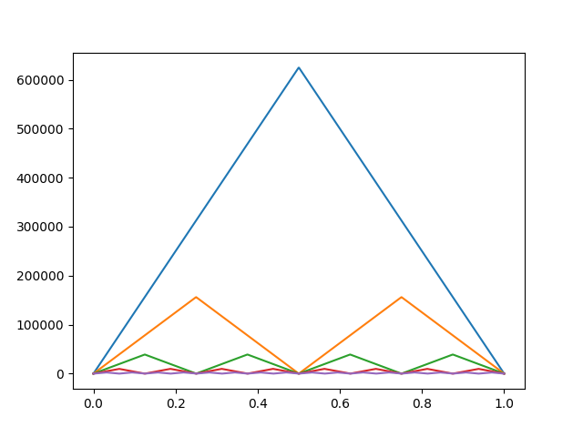

# 有限元分析 第三次程序作业

刘紫檀 SA21229063

## 问题描述

使用有限元方法求解如下的 PDE

$$
\begin{aligned}
&\left\{
\begin{aligned}
&-\epsilon u''(x) + u'(x) = x \\
&u(0) = u(1) = 0
\end{aligned}
\right.
\\

&\text{Using}\ V_h = \{ v \in H^1_0([0, 1]) \ v |_{i_j} \in P^1(I_j) \}
\end{aligned}
$$

分别在 $ \epsilon = 10^{-1} $ 和 $ \epsilon = 10^{-7} $ 上测试。

其中，网格分别选择如下两种：
1. 均匀网格
2. Shishkin 网格： 首先将 $[0, 1]$ 分为 $ [0, \tau] $ 和 $ [\tau, 1] $ 两部分（$ \tau = 1 - 2 \epsilon \ln N $），然后在两个区间分别使用均匀网格

## 原理·计算

### 真实解

用常数变异法可以得到如下的解

$$
u(x) = C_1 \epsilon e^{x/ \epsilon} + \frac{1}{2} x^2 + \epsilon x + C_2
$$

带入定解条件得到

$$
\begin{aligned}
u(x) &= - \frac{1/2 + \epsilon}{\epsilon(e^{1/\epsilon} - 1)} \epsilon e^{x/ \epsilon} + \frac{1}{2} x^2 + \epsilon x + \frac{1/2 + \epsilon}{e^{1/\epsilon} - 1} \\
&= \frac{1}{2} x^2 + \epsilon x - \frac{(1 + 2 \epsilon)(1-e^{x/\epsilon})}{2(1-e^{1/\epsilon})}
\end{aligned}
$$

### 当 $ \epsilon $ 很小时候的处理

$\epsilon$ 很小的时候， $e^{1/\epsilon}$ 很容易就会变成 NaN..

不过，

$$
\lim_{\epsilon \to 0} \frac{(1-e^{x/\epsilon})}{(1-e^{1/\epsilon})} = \lim_{\epsilon \to 0} x e^{\frac{x-1}{\epsilon}} = 0 \quad ( x \le 1 )
$$

所以不妨进行一些近似：

$$
\begin{aligned}
\frac{(1 + 2 \epsilon)(1-e^{x/\epsilon})}{2(1-e^{1/\epsilon})} &= \frac{(1 + 2 \epsilon)}{2} \frac{(1-e^{x/\epsilon})}{(1-e^{1/\epsilon})}\\
&\approx \frac{(1 + 2 \epsilon)}{2} \frac{e^{x/\epsilon}}{e^{1/\epsilon}} \\
&= \frac{(1 + 2 \epsilon)}{2} e^{(x-1)/\epsilon}

\end{aligned}
$$

### 变分

$$
\begin{aligned}
a(u, v) &= - \int_0^1 \epsilon u'' v dx + \int_0^1 u' v  dx \\
&= - \epsilon [u'v \bigg |_0^1 - \int_0^1 u'v' dx  ] + \int_0^1 u'v dx \\
&= \epsilon \int_0^1 u'v' dx + \int_0^1 u'v dx \\
&= \int_0^1 f v dx
\end{aligned}
$$

这个内积不是对称的，需要验证 Lax-Milgram 定理的条件以确保有限元唯一解。


### 有限元离散化

我们约定对解空间离散后的节点分别为 $ 0 = x_0 < x_1 \dots < x_{n-1} < x_n = n $，共 $ n + 1 $ 个节点。记 $ h_i =  x_{i} - x_{i-1} $

对于有限维空间 $ V_{h} $，可以选择一组基函数 $ \{ \phi_i(x) \}_{i=1}^{n-1} $ 。此时，变分问题可以转换为有限维变分问题。设 $ u_H \in V_{h} $ ，我们有
$$
u_H = \sum_j u_j \phi_j \\
$$
同时，由于 $ v_H \in  V_{h} $  可以表示成 $ \{ \phi_i(x) \}_{i=0}^n $  的线性组合，所以不妨直接将 $ v_H $ 带入 $ \phi_0, \phi_1, ..., \phi_n $ ，即可得到下面的形式
$$
\begin{aligned}
\mathrm{LHS} 
&= \epsilon \int_0^1 u_H'(x) \phi_i'(x) dx + \int_0^1 u_H'(x) \phi_i(x) dx \\
&= \epsilon \int_0^1 (\sum_j u_j \phi_j'(x)) \phi_i'(x) dx + \int_0^1 (\sum_j u_j \phi_j'(x)) \phi_i(x) dx  \\
&= \sum_j u_j \left( \epsilon\int_0^1 \phi_j'(x) \phi_i'(x) dx + \int_0^1 \phi_j'(x) \phi_i(x) dx\right) \\

\\
\mathrm{RHS}
&= \int_0^1 f(x) \phi_i(x) dx
\end{aligned}
$$
记 $ K_{ij} = \int_0^1 \phi_j'(x) \phi_i'(x) dx $，$ U_j = u_j $ ，$ F_i =  \int_0^1 f(x) \phi_i(x) dx $，则可以写成矩阵形式
$$
KU = F
$$

对于有限维空间 $ V_{h}  $，可以选择基函数 $ \{ \phi_i(x) \}_{i=1}^{n-1} $ 如下
$$
\phi_i(x) = \left\{
\begin{aligned}
&\frac{x-x_{i-1}}{x_{i}-x_{i-1}}, &x \in [x_{i-1}, x_{i}] \\
&\frac{x_{i+1} - x}{x_{i+1} - x_{i}}, &x \in [x_i, x_{i+1}] \\
&0, & x \notin [x_{i-1}, x_{i+1}]
\end{aligned}

\right.
$$
那么，我们可以计算 $\phi'_i(x)$ 和 $ K_{ij} $ 如下
$$
\phi'_i(x) = \left\{
\begin{aligned}
&\frac{1}{x_i - x_{i-1}} = \frac{1}{h_i}  , & x \in (x_{i-1}, x_i)  \\
&\frac{1}{x_{i} - x_{i+1}} = -\frac{1}{h_{i+1}}, & x \in (x_i, x_{i+1}) \\
\end{aligned}
\right.

\\

K_{ij} = \epsilon\int_0^1 \phi_j'(x) \phi_i'(x) dx + \int_0^1 \phi_j'(x) \phi_i(x) dx
$$

## 解的展示

总结一下：大概能看出收敛阶是 2。

可以看到，Shishkin 方法的误差在 $ \epsilon $ 较小时要远远好于均匀网格。 

### $ \epsilon = 0.1 $, Uniform
| N | $ L^1 $ error | order | $ L^\infty $ error | order |
| - | ------------- | ----- | ------------------ | ----- |
|2|2.040e-01|0.00000e+00|4.537e-01|0.00000e+00|
|4|3.284e-02|2.63502e+00|1.158e-01|1.96966e+00|
|8|8.264e-03|1.99065e+00|4.966e-02|1.22182e+00|
|16|1.891e-03|2.12738e+00|1.807e-02|1.45873e+00|
|32|4.630e-04|2.03050e+00|5.617e-03|1.68561e+00|

下面为此时解的情况：

下面为此时误差的情况：


### $ \epsilon = 0.1 $, shishkin
| N | $ L^1 $ error | order | $ L^\infty $ error | order |
| - | ------------- | ----- | ------------------ | ----- |
|2|3.532e-02|0.00000e+00|6.282e-02|0.00000e+00|
|4|1.969e-02|8.42823e-01|5.369e-02|2.26563e-01|
|8|6.341e-03|1.63488e+00|3.843e-02|4.82226e-01|
|16|2.209e-03|1.52147e+00|2.128e-02|8.52880e-01|
|32|7.884e-04|1.48623e+00|9.914e-03|1.10202e+00|

下面为此时解的情况：

下面为此时误差的情况：


### $ \epsilon = 0.001 $, Uniform
| N | $ L^1 $ error | order | $ L^\infty $ error | order |
| - | ------------- | ----- | ------------------ | ----- |
|2|3.108e+01|0.00000e+00|6.231e+01|0.00000e+00|
|4|7.590e+00|2.03399e+00|1.552e+01|2.00564e+00|
|8|1.737e+00|2.12771e+00|3.861e+00|2.00682e+00|
|16|3.323e-01|2.38573e+00|1.003e+00|1.94439e+00|
|32|6.190e-02|2.42463e+00|4.499e-01|1.15701e+00|

下面为此时解的情况：

下面为此时误差的情况：


### $ \epsilon = 0.001 $, shishkin
| N | $ L^1 $ error | order | $ L^\infty $ error | order |
| - | ------------- | ----- | ------------------ | ----- |
|2|6.663e-02|0.00000e+00|1.062e-01|0.00000e+00|
|4|1.752e-02|1.92685e+00|2.756e-02|1.94565e+00|
|8|5.082e-03|1.78575e+00|1.641e-02|7.47621e-01|
|16|1.495e-03|1.76497e+00|4.935e-03|1.73388e+00|
|32|3.658e-04|2.03146e+00|1.353e-03|1.86725e+00|

下面为此时解的情况：

下面为此时误差的情况：


### $ \epsilon = 1e-05 $, Uniform
| N | $ L^1 $ error | order | $ L^\infty $ error | order |
| - | ------------- | ----- | ------------------ | ----- |
|2|3.125e+03|0.00000e+00|6.244e+03|0.00000e+00|
|4|7.810e+02|2.00035e+00|1.561e+03|2.00006e+00|
|8|1.951e+02|2.00138e+00|3.902e+02|2.00012e+00|
|16|4.858e+01|2.00553e+00|9.734e+01|2.00300e+00|
|32|1.196e+01|2.02190e+00|2.426e+01|2.00424e+00|

下面为此时解的情况：

下面为此时误差的情况：


### $ \epsilon = 1e-05 $, shishkin
| N | $ L^1 $ error | order | $ L^\infty $ error | order |
| - | ------------- | ----- | ------------------ | ----- |
|2|6.716e-02|0.00000e+00|1.068e-01|0.00000e+00|
|4|1.745e-02|1.94472e+00|2.752e-02|1.95604e+00|
|8|5.034e-03|1.79307e+00|7.635e-03|1.84953e+00|
|16|1.541e-03|1.70770e+00|2.200e-03|1.79543e+00|
|32|4.360e-04|1.82177e+00|6.051e-04|1.86195e+00|

下面为此时解的情况：

下面为此时误差的情况：


### $ \epsilon = 1e-07 $, Uniform
| N | $ L^1 $ error | order | $ L^\infty $ error | order |
| - | ------------- | ----- | ------------------ | ----- |
|2|3.125e+05|0.00000e+00|6.244e+05|0.00000e+00|
|4|7.812e+04|2.00000e+00|1.561e+05|2.00000e+00|
|8|1.953e+04|2.00001e+00|3.902e+04|2.00000e+00|
|16|4.883e+03|2.00006e+00|9.756e+03|2.00003e+00|
|32|1.220e+03|2.00022e+00|2.439e+03|2.00005e+00|

下面为此时解的情况：

下面为此时误差的情况：


### $ \epsilon = 1e-07 $, shishkin
| N | $ L^1 $ error | order | $ L^\infty $ error | order |
| - | ------------- | ----- | ------------------ | ----- |
|2|6.716e-02|0.00000e+00|1.068e-01|0.00000e+00|
|4|1.745e-02|1.94483e+00|2.752e-02|1.95614e+00|
|8|5.034e-03|1.79306e+00|7.635e-03|1.84951e+00|
|16|1.542e-03|1.70708e+00|2.200e-03|1.79501e+00|
|32|4.371e-04|1.81860e+00|6.062e-04|1.85969e+00|

下面为此时解的情况：

下面为此时误差的情况：


## （超详细）运行指南

需要准备的东西：
- Python 3.8 （小版本无所谓）

> 为了确认 Python 已经安装好并且放到了环境变量里面，可以在终端（命令提示符 / Windows PowerShell）里面输入 `python` 看看能不能打开。有的时候会跳转到 Microsoft Store 的 Python 页面，如果没有安装的话。

运行之前需要安装 numpy 和 matplotlib 包。安装的方法如下：
```bash
python -m pip --install --user numpy matplotlib
```

这样就可以运行程序了。运行的方法：

```bash
python ./code/main.py
```
