# 有限元分析 第六次程序作业

## 问题描述

$$
\left\{
\begin{aligned}
&-\epsilon u'' + u' = x \\
&u(0) = u(1) = 0
\end{aligned}
\right.
$$

使用 Streamline-Diffusion 方法进行求解，即使用如下的变分形式

$$
\epsilon (u_h', v') + (u_h', v + \delta v') = (x, v + \delta v') \quad \forall v \in V_h^k
$$

在分片 $ P^1 $ 多项式元下求解，其中区间 $ I_j $ 上的 $ \delta $ 取 $ h_j $。

> 原来的形式是
> $$
> \epsilon (u_h', v') + (u_h', v) = (x, v) \quad \forall v \in V_h^k
> $$
> TODO: learn why SDFEM works

那么，方程最后要计算的就是

$$
 \epsilon (v', v') + (v', v) + (v', \delta v') = (x, v + \delta v')
$$

> 括号表示 $ L_2 $ 内积

## 实验结果

原方程的通解为

$$
\begin{aligned}
&u(x) = c_1 \epsilon e^{x/\epsilon} + c_2 + x^2/2 + x \epsilon
\end{aligned}
$$

带入边界条件后得到解

$$
\begin{aligned}
&u(x) = \frac{ \epsilon + 1/2}{1 - e^{1 / \epsilon}} (e^{x/ \epsilon} - 1) + \frac{1}{2} x^2 + \epsilon x
\end{aligned}
$$

对于 $ \epsilon $ 较小的情况，我们处理成
$$
\begin{aligned}
u(x) &= -\frac{e^{x/ \epsilon} - 1 }{e^{1 / \epsilon}-1}  (\epsilon + \frac{1}{2}) + \frac{1}{2} x^2 + \epsilon x \\
 &\approx -e^{(x-1)/\epsilon} (\epsilon + \frac{1}{2}) + \frac{1}{2} x^2 + \epsilon x 
\end{aligned}
$$

进行测试，结果如下

### $ \epsilon = 0.1 $, Uniform
| N | $ L^1 $ error | order | $ L^\infty $ error | order |
| - | ------------- | ----- | ------------------ | ----- |
|2|1.567e-01|0.00000e+00|3.193e-01|0.00000e+00|
|4|1.130e-01|4.71492e-01|2.592e-01|3.01201e-01|
|8|6.743e-02|7.45045e-01|1.720e-01|5.91691e-01|
|16|3.603e-02|9.03956e-01|1.064e-01|6.93140e-01|
|32|1.841e-02|9.68498e-01|6.035e-02|8.17564e-01|
|64|9.279e-03|9.88892e-01|3.214e-02|9.09262e-01|
|128|4.654e-03|9.95529e-01|1.662e-02|9.50868e-01|

下面为此时解的情况：
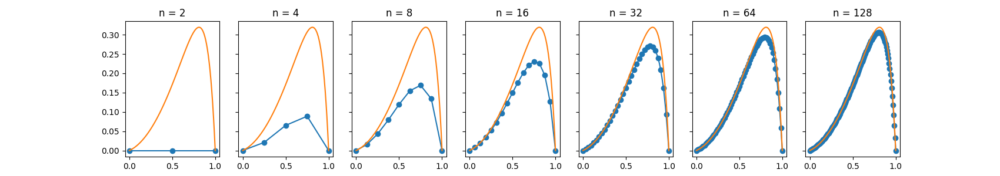
下面为此时误差的情况：
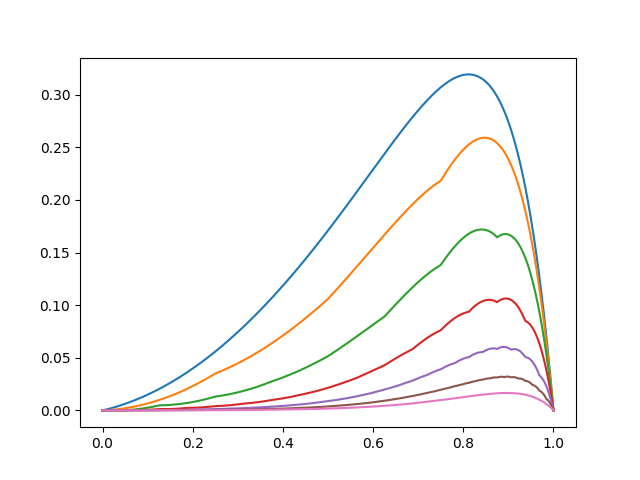

### $ \epsilon = 0.1 $, shishkin
| N | $ L^1 $ error | order | $ L^\infty $ error | order |
| - | ------------- | ----- | ------------------ | ----- |
|2|6.210e-02|0.00000e+00|1.395e-01|0.00000e+00|
|4|7.640e-02|-2.98853e-01|1.752e-01|-3.28766e-01|
|8|5.867e-02|3.80870e-01|1.554e-01|1.73097e-01|
|16|3.921e-02|5.81394e-01|1.158e-01|4.24922e-01|
|32|2.409e-02|7.02816e-01|7.883e-02|5.54468e-01|
|64|1.448e-02|7.34142e-01|5.021e-02|6.50855e-01|
|128|8.787e-03|7.20852e-01|3.099e-02|6.95903e-01|

下面为此时解的情况：
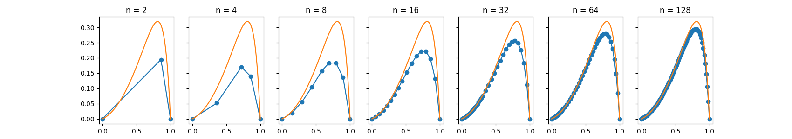
下面为此时误差的情况：
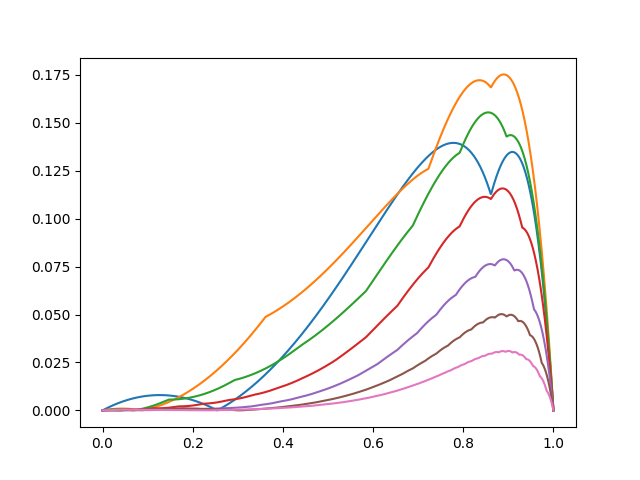

### $ \epsilon = 0.001 $, Uniform
| N | $ L^1 $ error | order | $ L^\infty $ error | order |
| - | ------------- | ----- | ------------------ | ----- |
|2|1.666e-01|0.00000e+00|5.010e-01|0.00000e+00|
|4|1.141e-01|5.45868e-01|5.010e-01|0.00000e+00|
|8|6.176e-02|8.85702e-01|5.010e-01|0.00000e+00|
|16|3.124e-02|9.83161e-01|5.010e-01|0.00000e+00|
|32|1.561e-02|1.00095e+00|5.010e-01|0.00000e+00|
|64|7.762e-03|1.00801e+00|5.010e-01|0.00000e+00|
|128|3.840e-03|1.01534e+00|5.010e-01|0.00000e+00|

下面为此时解的情况：
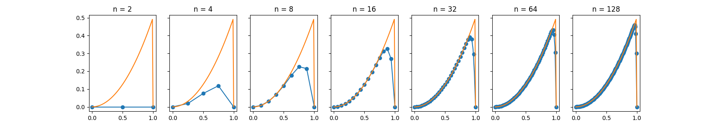
下面为此时误差的情况：
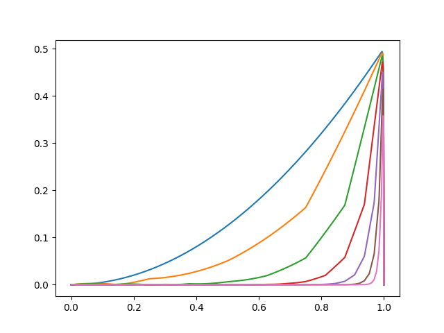

### $ \epsilon = 0.001 $, shishkin
| N | $ L^1 $ error | order | $ L^\infty $ error | order |
| - | ------------- | ----- | ------------------ | ----- |
|2|5.190e-02|0.00000e+00|5.010e-01|0.00000e+00|
|4|3.547e-02|5.49399e-01|5.010e-01|0.00000e+00|
|8|1.218e-02|1.54212e+00|5.010e-01|0.00000e+00|
|16|2.792e-03|2.12508e+00|5.010e-01|0.00000e+00|
|32|8.354e-04|1.74056e+00|5.010e-01|0.00000e+00|
|64|5.224e-04|6.77381e-01|5.010e-01|0.00000e+00|
|128|4.928e-04|8.39751e-02|5.010e-01|0.00000e+00|

下面为此时解的情况：
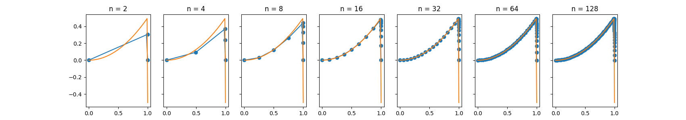
下面为此时误差的情况：
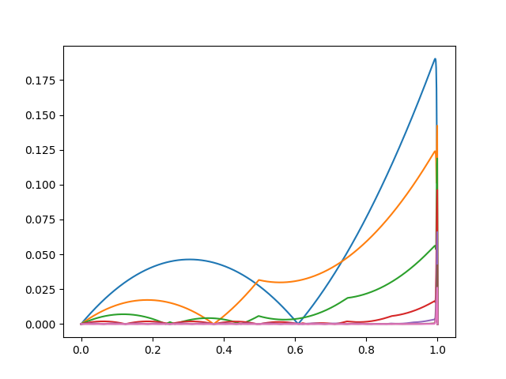

### $ \epsilon = 1e-05 $, Uniform
| N | $ L^1 $ error | order | $ L^\infty $ error | order |
| - | ------------- | ----- | ------------------ | ----- |
|2|1.667e-01|0.00000e+00|5.000e-01|0.00000e+00|
|4|1.141e-01|5.46583e-01|5.000e-01|0.00000e+00|
|8|6.174e-02|8.86061e-01|5.000e-01|0.00000e+00|
|16|3.127e-02|9.81422e-01|5.000e-01|0.00000e+00|
|32|1.567e-02|9.97077e-01|5.000e-01|0.00000e+00|
|64|7.834e-03|9.99996e-01|5.000e-01|0.00000e+00|
|128|3.919e-03|9.99104e-01|5.000e-01|0.00000e+00|

下面为此时解的情况：
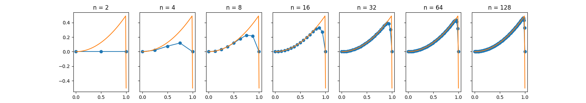
下面为此时误差的情况：

### $ \epsilon = 1e-05 $, shishkin
| N | $ L^1 $ error | order | $ L^\infty $ error | order |
| - | ------------- | ----- | ------------------ | ----- |
|2|5.200e-02|0.00000e+00|5.000e-01|0.00000e+00|
|4|3.522e-02|5.61921e-01|5.000e-01|0.00000e+00|
|8|1.191e-02|1.56415e+00|5.000e-01|0.00000e+00|
|16|2.599e-03|2.19635e+00|5.000e-01|0.00000e+00|
|32|6.692e-04|1.95744e+00|5.000e-01|0.00000e+00|
|64|3.357e-04|9.95292e-01|5.000e-01|0.00000e+00|
|128|2.705e-04|3.11406e-01|5.000e-01|0.00000e+00|

下面为此时解的情况：
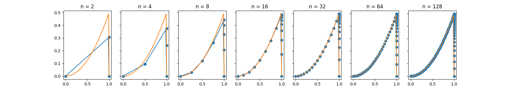
下面为此时误差的情况：
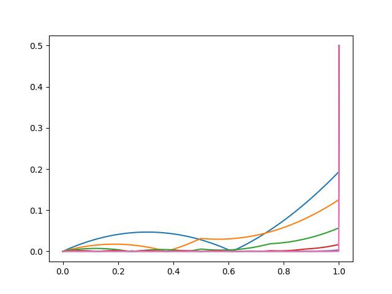

### $ \epsilon = 1e-07 $, Uniform
| N | $ L^1 $ error | order | $ L^\infty $ error | order |
| - | ------------- | ----- | ------------------ | ----- |
|2|1.667e-01|0.00000e+00|5.000e-01|0.00000e+00|
|4|1.141e-01|5.46613e-01|5.000e-01|0.00000e+00|
|8|6.174e-02|8.86127e-01|5.000e-01|0.00000e+00|
|16|3.127e-02|9.81537e-01|5.000e-01|0.00000e+00|
|32|1.566e-02|9.97306e-01|5.000e-01|0.00000e+00|
|64|7.829e-03|1.00045e+00|5.000e-01|0.00000e+00|
|128|3.914e-03|1.00002e+00|5.000e-01|0.00000e+00|

下面为此时解的情况：

下面为此时误差的情况：
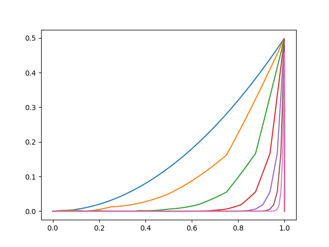

### $ \epsilon = 1e-07 $, shishkin
| N | $ L^1 $ error | order | $ L^\infty $ error | order |
| - | ------------- | ----- | ------------------ | ----- |
|2|5.200e-02|0.00000e+00|5.000e-01|0.00000e+00|
|4|3.522e-02|5.62050e-01|5.000e-01|0.00000e+00|
|8|1.191e-02|1.56430e+00|5.000e-01|0.00000e+00|
|16|2.598e-03|2.19654e+00|5.000e-01|0.00000e+00|
|32|6.690e-04|1.95740e+00|5.000e-01|0.00000e+00|
|64|3.357e-04|9.94975e-01|5.000e-01|0.00000e+00|
|128|2.705e-04|3.11266e-01|5.000e-01|0.00000e+00|

下面为此时解的情况：

下面为此时误差的情况：
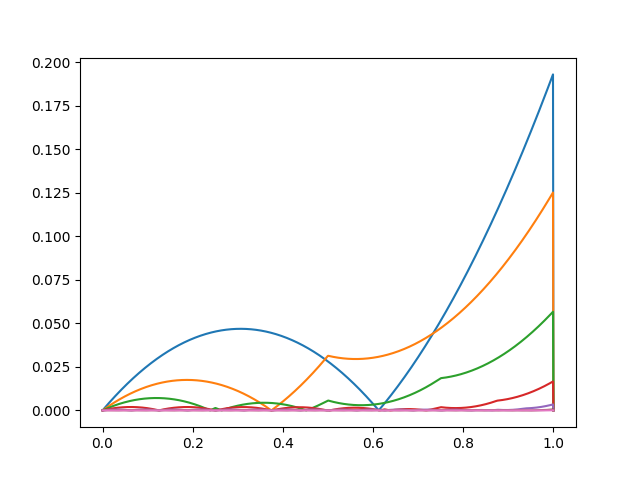
### 总结

这个阶在 $ \epsilon $ 较小的时候表现好奇怪...

$ L_\infty $ 在较小时不收敛，应该是因为靠近 1 时的误差。

除此之外，$ L_1 $ 近似是一阶收敛。

> 并不是很懂为什么orz